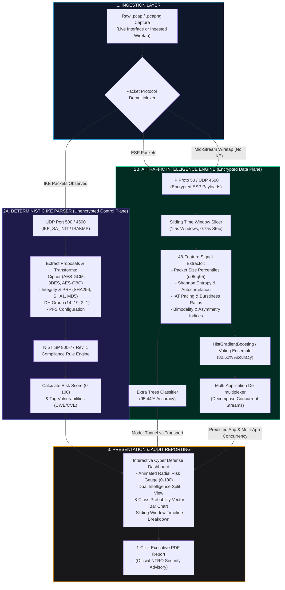

# NTRO IPsec VPN Intelligence Platform: Concept Guide, Master Lexicon & Operational Blueprint
**Smart India Hackathon 2026 | Problem Statement: SIH26160**  
**Organization:** National Technical Research Organisation (NTRO)  
**Theme:** Cybersecurity & Defense Intelligence  

---

## 1. Executive Context: Why Are We Building This?

### 1.1 The Operational Paradox of IPsec VPNs
Virtual Private Networks (VPNs) built on **IPsec (Internet Protocol Security)** form the digital backbone of national defense networks, intelligence communications, military field gateways, and critical government backbones. 

IPsec achieves this by wrapping raw network communication in mathematical armor:
1. **Confidentiality:** Scrambling data so eavesdroppers on the wire cannot read messages.
2. **Integrity:** Ensuring packets cannot be modified in transit without detection.
3. **Authentication:** Proving that the parties communicating are who they claim to be.

```
+--------------------------------------------------------------------------------------------------+
|                                    THE IPsec SECURITY PARADOX                                    |
+--------------------------------------------------------------------------------------------------+
|  The very mathematical encryption designed to hide secrets from adversarial wiretappers          |
|  ALSO BLINDS CYBER DEFENSE OPERATORS AND NETWORK ANALYSTS!                                       |
|                                                                                                  |
|  Inside an encrypted IPsec tunnel, network monitors CANNOT see:                                 |
|  - Whether weak, deprecated ciphers (e.g., 3DES, MD5, DH-Group 2) are leaving the link vulnerable|
|  - What applications (VoIP, Video, Chat, Bulk Data Exfiltration) are actively flowing             |
|  - Whether malware is tunneling unauthorized data through an approved gateway                     |
|  - Whether side-channel metadata leaks are exposing covert military operations                   |
+--------------------------------------------------------------------------------------------------+
```

### 1.2 Traditional Packet Analysis vs. The AI-Powered Platform
Traditionally, assessing an IPsec link requires senior security engineers to capture raw `.pcap` files with Wireshark/tcpdump, manually navigate thousands of hex frames, dissect complex IKE handshake attributes, and guess what traffic is running through the encrypted ESP stream.

| Dimension | WITHOUT Our Solution (Traditional Manual Analysis) | WITH Our Solution (SIH26160 Automated Platform) |
|---|---|---|
| **Analysis Speed** | Hours to days of manual Wireshark hex-packet dissection per incident. | **Sub-second (instantaneous)** automated ingestion and assessment. |
| **Expertise Barrier** | Requires specialized cryptographic protocol knowledge and RFC expertise. | **Zero barrier:** Accessible to junior analysts via automated dashboards. |
| **Encrypted Payload Visibility** | **Completely blind:** ESP payloads are opaque black boxes. | **Full visibility:** AI classifies inner traffic (VoIP, Video, Web, Chat) via packet dynamics. |
| **Missing Handshake Wiretaps** | **Fails completely:** Cannot audit ongoing tunnels without captured IKE handshake. | **Graceful fallback:** AI identifies operational mode (`tunnel`/`transport`) and traffic without IKE. |
| **Compliance Auditing** | Manual lookup against 80+ pages of NIST SP 800-77 and NSA CNSA standards. | **Automated audit matrix:** Instant 0–100 risk score, threat matrix, and CWE tags. |
| **Concurrent Multiplexing** | Impossible to detect when multiple apps share a single tunnel. | **AI De-multiplexing:** Automatically decomposes mixed multi-application streams. |
| **Executive Reporting** | Manual copy-pasting into slide decks or spreadsheets. | **1-Click PDF generation:** High-contrast executive briefing and technical advisory. |

---

## 2. Master Terminology, Keywords & Full Forms Lexicon

### A. Organizations, Standards & Regulatory Frameworks
- **NTRO (National Technical Research Organisation):** India's premier technical intelligence agency under the Prime Minister's Office (PMO), responsible for geospatial intelligence, cyber defense, and signals intelligence.
- **SIH (Smart India Hackathon):** The world's largest open-innovation digital hackathon initiative by the Ministry of Education, Government of India.
- **NIST (National Institute of Standards and Technology):** US agency that publishes foundational cryptographic benchmarks used globally by intelligence and enterprise sectors.
- **NIST SP 800-77 Rev. 1:** *"Guide to IPsec VPNs"* — the definitive security standard specifying approved encryption ciphers, key negotiation lifespans, authentication hashes, and operational modes.
- **NIST SP 800-131A Rev. 2:** Official guide transitioning broken and deprecated cryptographic algorithms (e.g., forbidding 3DES, DES, SHA-1, and small Diffie-Hellman groups).
- **NSA CNSA Suite (Commercial National Security Algorithm):** Cryptographic algorithm guidelines specified by the US National Security Agency for protecting classified national security systems (often CNSA 2.0 with post-quantum baselines).
- **IETF (Internet Engineering Task Force):** The international standards organization that authors RFC documents defining Internet protocols.
- **RFC (Request for Comments):** Formal peer-reviewed specification documents published by the IETF:
  - *RFC 7296:* Internet Key Exchange Protocol Version 2 (IKEv2).
  - *RFC 2409:* The Internet Key Exchange (IKEv1 / ISAKMP).
  - *RFC 9395:* Deprecation of IKEv1 and Historic Cryptographic Algorithms.
  - *RFC 4301 / 4303:* Security Architecture for the Internet Protocol & IP Encapsulating Security Payload (ESP).

---

### B. Core IPsec Protocol Architecture & Headers
- **IPsec (Internet Protocol Security):** A suite of open protocols operating at Layer 3 (Network Layer) of the OSI model that secures IP communications by authenticating and encrypting each IP packet of a communication session.
- **IKE (Internet Key Exchange):** The control-plane protocol running on UDP port 500 (or UDP port 4500 when traversing NAT) responsible for mutual authentication and negotiating cryptographic keys.
  - **IKEv1:** Legacy key exchange (RFC 2409, deprecated by RFC 9395). Uses **Main Mode** (6 packets) or **Aggressive Mode** (3 packets). Susceptible to dictionary attacks and lacks native DoS cookie defenses.
  - **IKEv2:** Modern key exchange (RFC 7296). Operates in fewer round trips (`IKE_SA_INIT` and `IKE_AUTH`), natively supports NAT-Traversal, and features built-in DoS resilience.
- **ISAKMP (Internet Security Association and Key Management Protocol):** The structural framework defining payload exchange formats and message construction used by IKEv1.
- **SA (Security Association):** A formal contract established between two VPN endpoints that specifies the shared keys, cipher algorithms, SPIs, and sequence numbers used to protect the tunnel.
- **ESP (Encapsulating Security Payload - IP Protocol 50):** The data-plane protocol that encrypts, authenticates, and encapsulates the inner communication payload.
- **AH (Authentication Header - IP Protocol 51):** An older IPsec sub-protocol that provides data integrity and authentication *without* encryption. (Rarely used in modern VPNs because it does not traverse NAT).
- **NAT-T (NAT-Traversal - UDP Port 4500):** A mechanism that encapsulates raw ESP packets inside standard UDP datagrams so they can traverse Network Address Translation (NAT) firewalls and home routers without corrupting the cryptographic checksums.
- **SPI (Security Parameter Index):** A 32-bit arbitrary hexadecimal value assigned to an SA by the receiving end. The SPI appears in the clear on the outer packet header so the receiving gateway knows which decryption key to use without decrypting the payload first.
- **Sequence Number:** A monotonically increasing 32-bit or 64-bit integer inside every ESP packet header used to prevent **replay attacks** (adversaries recording a valid packet and re-transmitting it later to cause disruption).

---

### C. Operational Modes: Tunnel vs. Transport
- **Tunnel Mode (Gateway-to-Gateway / Remote-Access):**
  - The **entire original IP packet** (inner IP header + payload) is encrypted.
  - A **brand new outer IP header** is prepended by the VPN gateway.
  - Used for connecting branch offices or securing client-to-gateway remote connections.
- **Transport Mode (Host-to-Host):**
  - Only the **L4 payload** (TCP/UDP data) is encrypted.
  - The **original IP header is preserved** and left in the clear.
  - Used for end-to-end server-to-server communications within trusted subnets.

```
+--------------------------------------------------------------------------------------------------+
|                            TUNNEL MODE VS. TRANSPORT MODE ON THE WIRE                            |
+--------------------------------------------------------------------------------------------------+

1. ORIGINAL RAW IP PACKET (Before IPsec):
+--------------------+------------------------+----------------------------------------------------+
| Original IP Header | TCP / UDP Header (L4)  | Application Payload (Data)                         |
+--------------------+------------------------+----------------------------------------------------+

2. TRANSPORT MODE (Host-to-Host - IP Header Preserved):
+--------------------+------------+------------------------+-------------------+--------------------+
| Original IP Header | ESP Header | TCP / UDP Header [ENC] | Application [ENC] | ESP Trailer + ICV  |
+--------------------+------------+------------------------+-------------------+--------------------+
                     |<------------------------ ENCRYPTED RANGE ----------------------->|

3. TUNNEL MODE (Gateway-to-Gateway - Double IP Header Encapsulation):
+--------------------+------------+--------------------+------------------------+-------------------+
|  New Outer IP Hdr  | ESP Header | Original IP Header | TCP/UDP + App Payload  | ESP Trailer + ICV |
|  (Gateway Addrs)   |            | [ENCRYPTED]        | [ENCRYPTED]            |                   |
+--------------------+------------+--------------------+------------------------+-------------------+
                                  |<----------------- ENCRYPTED RANGE ----------------->|
```

---

### D. Cryptographic Primitives & Ciphers
- **Symmetric Encryption:** Ciphers where the same key is used to encrypt and decrypt traffic.
  - **AEAD (Authenticated Encryption with Associated Data):** Modern ciphers that simultaneously encrypt data and calculate an unforgeable cryptographic integrity check in a single pass.
    - **AES-GCM (Galois/Counter Mode):** The gold-standard AEAD cipher (AES-128-GCM, AES-256-GCM) recommended by NIST SP 800-77.
    - **ChaCha20-Poly1305:** High-speed AEAD cipher designed for high efficiency on devices without hardware AES acceleration.
  - **CBC (Cipher Block Chaining):** Older block cipher mode (e.g., `AES-CBC`, `3DES-CBC`). Requires a separate integrity hash (HMAC) and is vulnerable to padding oracle attacks (e.g., Lucky Thirteen - CVE-2013-0169) if implemented incorrectly.
  - **3DES (Triple Data Encryption Standard):** Legacy cipher that applies DES three times. **Critical failure:** uses a 64-bit block size vulnerable to birthday collision attacks (**Sweet32 - CVE-2016-2183**). Completely banned by NIST SP 800-131A.
  - **DES:** Obsolete 56-bit cipher easily cracked in minutes. Banned.
- **Integrity & Message Authentication Codes (MAC):**
  - **HMAC (Hash-based Message Authentication Code):** Guarantees that ciphertext was not tampered with.
  - **SHA-2 (Secure Hash Algorithm 2):** Modern cryptographic hash family (`SHA-256`, `SHA-384`, `SHA-512`). Fully compliant with NIST SP 800-77.
  - **SHA-1:** Deprecated 160-bit hash broken by practical collision attacks (**SHAttered attack**). Forbidden by NIST.
  - **MD5:** Broken 128-bit hash algorithm. Trivial collision attacks. Banned.
  - **PRF (Pseudo-Random Function):** Cryptographic function used during IKE key negotiation to derive keying material from shared Diffie-Hellman secrets.
- **Diffie-Hellman (DH) Key Exchange:** Mathematical protocol allowing two untrusted endpoints to establish a shared secret over an insecure channel without an eavesdropper discovering it.
  - **MODP (Modular Exponential) Groups:** Traditional discrete-logarithm DH.
    - *Group 1 (768-bit):* Broken. Factorable in hours. Banned.
    - *Group 2 (1024-bit):* Broken. Vulnerable to state-sponsored precomputation (**Logjam attack**). Banned.
    - *Group 5 (1536-bit):* Weak. Fails to meet the 112-bit security requirement. Deprecated.
    - *Group 14 (2048-bit):* Baseline secure standard (112-bit security level). Compliant with NIST SP 800-77.
    - *Group 15 (3072-bit) / Group 16 (4096-bit):* High-security defense grade.
  - **ECP (Elliptic Curve Cryptography) Groups:** Uses elliptic curve discrete logarithms for faster computation and smaller key sizes.
    - *Group 19 (NIST P-256 / 256-bit ECP):* Highly secure, fast, 128-bit security equivalent.
    - *Group 20 (NIST P-384 / 384-bit ECP):* NSA CNSA compliant, 192-bit security equivalent.
    - *Group 31 (Curve25519):* Modern high-performance Montgomery curve.
- **PFS (Perfect Forward Secrecy):** A security feature where a fresh Diffie-Hellman exchange is performed for every child session. If an adversary steals the gateway's private key in the future, they **cannot** retroactively decrypt past intercepted sessions.

---

### E. Real-World Imperfections & Wire Dynamics
- **Jitter:** The statistical variation in packet transit delay. Real-world cellular, satellite, and WAN links exhibit packet jitter that distorts smooth traffic pacing.
- **Packet Loss & Drops:** Lost packets in transit that trigger TCP retransmission storms and out-of-order sequence arrivals.
- **Packet Reordering:** Multi-path Internet routing that causes packet $N+2$ to arrive before packet $N+1$.
- **MTU (Maximum Transmission Unit) Truncation & Fragmentation:** Outer IPsec ESP headers add 50–70 bytes of overhead to every packet. When an inner packet is 1500 bytes, the combined packet exceeds the network MTU, causing outer fragmentation into multiple smaller packets.
- **Mid-Stream ESP Wiretap:** A passive interception attached to an ongoing VPN connection *after* the initial IKE key exchange finished. The observer captures raw encrypted ESP packets without having seen the unencrypted IKE handshake.
- **Background Noise / Chaff:** Unrelated ambient packets (ARP, DNS, NTP, HTTP scans) interleaved on the physical link alongside the VPN stream.

---

### F. Machine Learning & Statistical Signal Features
- **Statistical Flow Fingerprinting:** Analyzing physical packet timing, size distributions, and directional ratios to identify the application inside an encrypted stream without decrypting a single byte.
- **IAT (Inter-Arrival Time):** The time delta $\Delta t = t_i - t_{i-1}$ between consecutive packets. VoIP packets exhibit steady $\approx 20\text{ms}$ pacing; bulk downloads exhibit microsecond pacing.
- **Shannon Entropy of Packet Lengths:** A measure of unpredictability/diversity in packet sizes:
  $$H(X) = -\sum_{i} P(x_i) \log_2 P(x_i)$$
  Low entropy characterizes narrow audio codecs (VoIP); high entropy characterizes multi-asset web page downloads (HTML, images, JS).
- **Lag-1 Autocorrelation of Packet Sizes:** Measures the correlation between packet $N$ and packet $N+1$. Captures request-response alternation in interactive web browsing and API transactions.
- **Bimodality Index:** Quantifies the separation between clusters of small control packets and full MTU payload packets:
  $$\text{Bimodal Index} = \frac{|\mu_{\text{large}} - \mu_{\text{small}}|}{\sigma_{\text{total}}}$$
  High bimodality indicates multi-application multiplexing (e.g., browsing + chat running simultaneously).
- **Bagging (Bootstrap Aggregating):** Ensembling technique (e.g., Random Forest, Extra Trees) that trains multiple decision trees on random subsets of data to drastically reduce model **variance**.
- **Boosting:** Ensembling technique (e.g., XGBoost, LightGBM, HistGradientBoosting) that sequentially trains trees, with each tree explicitly correcting the errors of previous trees to reduce model **bias**.
- **Soft Voting Ensemble:** Blends class probability vectors from multiple distinct models:
  $$P_{\text{ensemble}}(c) = \sum_{m} w_m P_m(c)$$
- **Stacking Ensemble:** Uses out-of-fold predictions from base models as input features to a meta-classifier (e.g., Logistic Regression) that learns optimal model weighting.

---

## 3. Visual System Architecture & Concept Association Maps

### 3.1 Packet Flow & Dual Identification Architecture



---

### 3.2 The Cryptographic Handshake vs. Data Flow Timeline

```mermaid
sequenceDiagram
    autonumber
    participant Initiator as VPN Initiator (172.28.0.2)
    participant Wire as Physical Wire / Adversary Wiretap
    participant Responder as VPN Responder (172.28.0.3)

    rect rgb(20, 30, 60)
        Note over Initiator, Responder: PHASE 1: UNENCRYPTED KEY NEGOTIATION (IKE_SA_INIT)
        Initiator->>Wire: UDP 500: IKE_SA_INIT (Proposals: AES-GCM, SHA256, DH Group 14, Nonce_I)
        Wire->>Responder: Proposals delivered across wire
        Note over Wire: [OUR PARSER INTERCEPTS]: Extracts Cipher, PRF, Hash, DH Group (100% Deterministic)
        Responder->>Wire: UDP 500: IKE_SA_INIT (Chosen Transform, DH Public Value, Nonce_R)
        Wire->>Initiator: Negotiation confirmed
    end

    rect rgb(40, 20, 50)
        Note over Initiator, Responder: PHASE 2: MUTUAL AUTHENTICATION & CHILD SA (IKE_AUTH)
        Initiator->>Wire: UDP 500/4500: IKE_AUTH [Encrypted with IKE SA keys] (Identity, PSK/Cert Auth)
        Wire->>Responder: Verified
        Responder->>Wire: UDP 500/4500: IKE_AUTH [Encrypted] (Identity, Traffic Selectors)
        Wire->>Initiator: IPsec SA Established
    end

    rect rgb(10, 40, 30)
        Note over Initiator, Responder: DATA PLANE: ENCRYPTED ESP COMMUNICATION (Protocol 50 / UDP 4500)
        Initiator->>Wire: ESP: SPI=0xca579779, Seq=1 [ENCRYPTED VoIP Audio Frame, Length: 290B]
        Initiator->>Wire: ESP: SPI=0xca579779, Seq=2 [ENCRYPTED VoIP Audio Frame, Length: 290B, +20ms]
        Note over Wire: [OUR AI ENGINE INTERCEPTS]: No Decryption Needed!<br/>Extracts 48 Statistical Features (IAT=20ms, Size=290B, Entropy=Low)<br/>Infers: 99.8% Confidence VoIP Stream
        Responder->>Wire: ESP: SPI=0xcb1dd683, Seq=1 [ENCRYPTED VoIP Return Audio]
    end
```



---

## 4. Problem Statement Feature Traceability Matrix

Every single explicit requirement mandated by NTRO is satisfied by our modular architecture:

| NTRO PS Mandate | Sub-Requirement | Implementation Mechanism in Our Solution | Deliverable File Link |
|---|---|---|---|
| **Requirement (a)** | Dynamic VPN Testbed | Docker containerized strongSwan environment with `tc-netem` injecting jitter, drops, reordering, MTU fragmentation, and background noise. | [`generate_dataset.py`](file:///c:/Users/Shrey/My%20Drive/SIH26/generate_dataset.py)<br>[`testbed/docker-compose.yml`](file:///c:/Users/Shrey/My%20Drive/SIH26/testbed/docker-compose.yml) |
| **Requirement (a)** | Protocol Variations | Tunnel vs Transport modes, AES-GCM (128/256), AES-CBC + HMAC, 3DES, DH Groups 1, 2, 14, PFS enabled/disabled. | [`testbed/scripts/ipsec_manager.py`](file:///c:/Users/Shrey/My%20Drive/SIH26/testbed/scripts/ipsec_manager.py) |
| **Requirement (a)** | Traffic Types | 8 realistic application profiles: VoIP, Video, Web, Chat, Email, Bulk, ICMP, and Concurrent Mixed flows. | [`testbed/scripts/traffic_generator.py`](file:///c:/Users/Shrey/My%20Drive/SIH26/testbed/scripts/traffic_generator.py) |
| **Requirement (b)** | Traffic Capture | Capture engine capturing IKE handshakes, ESP packets, and mid-stream wiretaps into standardized `.pcapng` files paired with JSON ground truth. | [`testbed/scripts/capture_worker.py`](file:///c:/Users/Shrey/My%20Drive/SIH26/testbed/scripts/capture_worker.py)<br>[`dataset/manifest.json`](file:///c:/Users/Shrey/My%20Drive/SIH26/dataset/manifest.json) |
| **Requirement (c)** | Deterministic Protocol Parsing | Dissects unencrypted IKEv1 and IKEv2 packets, extracting ciphers, key lengths, hashes, PRFs, and DH groups with 100% accuracy. | [`analyzer/ike_parser.py`](file:///c:/Users/Shrey/My%20Drive/SIH26/analyzer/ike_parser.py) |
| **Requirement (c)** | AI Traffic Classification | Multi-class machine learning classifier predicting application type inside encrypted ESP flows without decryption. | [`ai/train_models.py`](file:///c:/Users/Shrey/My%20Drive/SIH26/ai/train_models.py)<br>[`ai/inference.py`](file:///c:/Users/Shrey/My%20Drive/SIH26/ai/inference.py) |
| **Requirement (c)** | Mode Inference | Machine learning model distinguishing Tunnel vs. Transport mode (95.44% accuracy) even when IKE handshakes are missing. | [`models/mode_classifier.joblib`](file:///c:/Users/Shrey/My%20Drive/SIH26/models/mode_classifier.joblib) |
| **Requirement (d)** | Security Assessment | NIST SP 800-77 Rev. 1 compliance rule engine scoring configurations from 0 to 100, tagging CVEs/CWEs, and generating threat matrices. | [`analyzer/security_evaluator.py`](file:///c:/Users/Shrey/My%20Drive/SIH26/analyzer/security_evaluator.py) |
| **Requirement (e)** | Interactive Dashboard & Reports | Modern dark-mode web UI with animated radial score gauge, 1-click test scenarios, drag-and-drop PCAP upload, and 1-click PDF export. | [`dashboard/app.py`](file:///c:/Users/Shrey/My%20Drive/SIH26/dashboard/app.py)<br>[`dashboard/static/index.html`](file:///c:/Users/Shrey/My%20Drive/SIH26/dashboard/static/index.html) |
